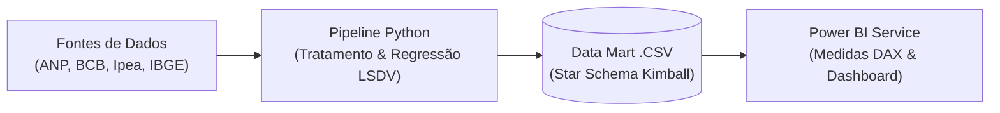

# 📘Business Intelligence e ciência de dados aplicados à análise da transmissão de preços dos combustíveis no Brasil

[](https://app.powerbi.com/view?r=eyJrIjoiM2VhNmYyMjQtODJkNy00ZDYyLTg0NzktNDViZDUxMmRiNWQ0IiwidCI6IjdhNTkyOTcwLWJlNzktNGFjNS05YTI0LWY2ODNiMGI2NWZjYiJ9)


## 📌 Sobre o Projeto
Este repositório contém o código-fonte, pipeline de dados e documentação do Trabalho de Conclusão de Curso (TCC) do MBA em **Data Science and Analytics (USP Esalq)**

O objetivo do trabalho é quantificar a capacidade explicativa e a taxa de repasse (*pass-through*) da variação do petróleo **Brent** e da taxa de câmbio (**Dólar PTAX**) sobre os preços praticados ao consumidor final no Brasil (Gasolina, Diesel S10 e Etanol) entre janeiro de 2023 e dezembro de 2025.

A solução combina um motor de engenharia e modelagem econométrica em **Python** com um painel analítico interativo em **Microsoft Power BI** baseado no modelo dimensional de Kimball (*Star Schema*)

🔗**[<font color='F2C94C'>Acessar Painel Interativo PBI Web</font>](https://app.powerbi.com/view?r=eyJrIjoiM2VhNmYyMjQtODJkNy00ZDYyLTg0NzktNDViZDUxMmRiNWQ0IiwidCI6IjdhNTkyOTcwLWJlNzktNGFjNS05YTI0LWY2ODNiMGI2NWZjYiJ9)**

---

## Arquitetura da Solução



##  📁 Estrutura do Repositório
``` 
├── data/
│   ├── raw/                  # Arquivos brutos baixados (ANP,  Ipea, BCB, IBGE)
│   └── processed/            # Tabelas Fato e Dimensão processadas em .csv
├── scripts/
│   ├── 01_Processamento.py     # Tratamento e unificação das bases
│   ├── 02_Modelagem.py    # Regressão LSDV e testes de Pearson
│   └── 03_Arquitetura.py            # Geração das tabelas Fato e Dimensão (Kimball)
├── dashboard/
│   └── painel_combustiveis.pbix      # Dashboard interativo do Power BI
├── .gitignore                
├── requirements.txt          # Dependências do ecossistema Python
└── README.md                 # Documentação do projeto
```

## 🛠️ Ferramentas Utilizadas
- **Linguagens & Bibliotecas:** Python (`pandas`, `numpy`, `statsmodels`, `scipy`, `yfinance`)
- **Business Intelligence:** Microsoft Power BI (Power Query, Modelagem Star Schema, Linguagem DAX)
- **IDE & Versionamento:** VS Code | Git & GitHub

## 👩🏻‍💻 Autora
**Talita Figueiredo Claro**<br>
Engenheira Química (FASB) | MBA Data Science e Analytics (USP Esalq)
